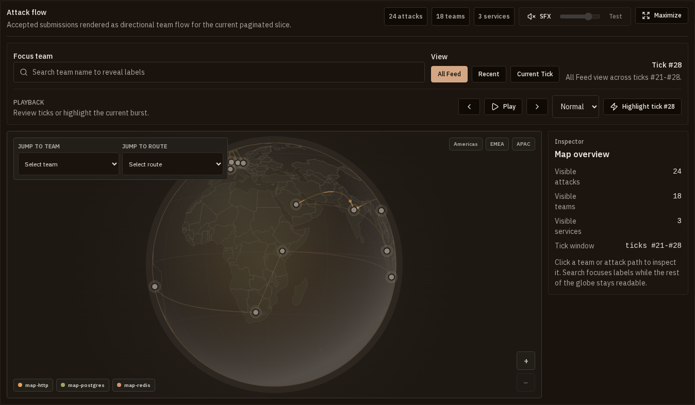
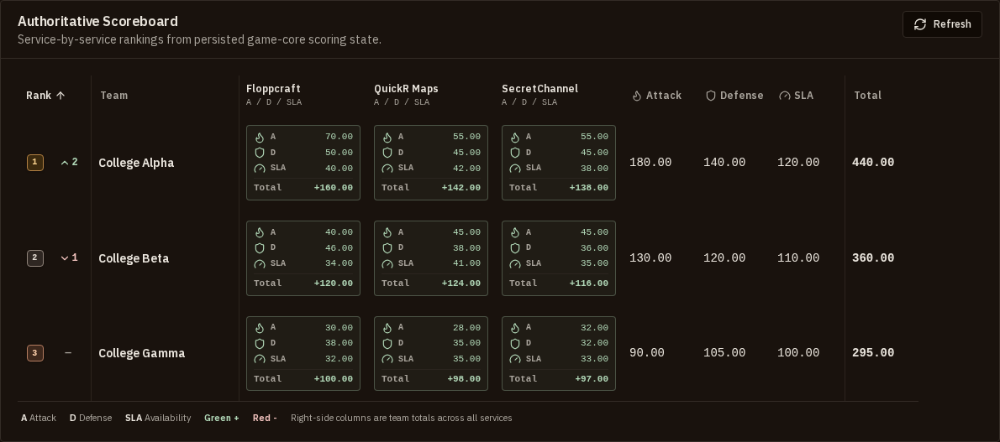
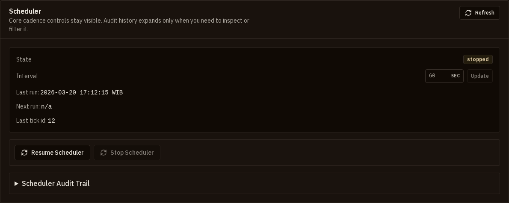
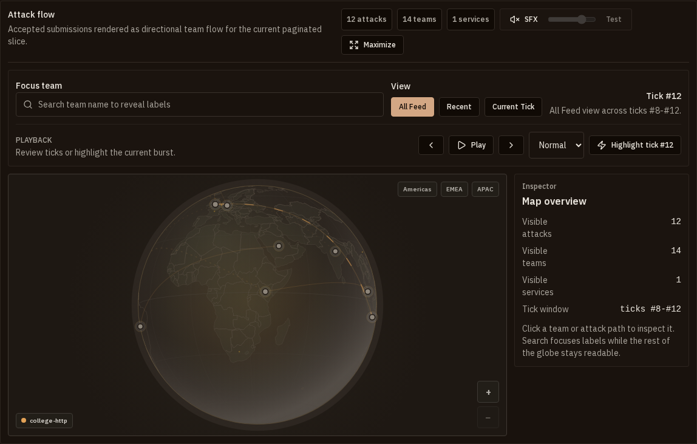

# ADTickPlatform

A comprehensive, production-ready Attack-Defense Tick Capture The Flag (CTF) platform.

[](https://go.dev)
[](https://www.typescriptlang.org)
[](https://www.docker.com/)
[](LICENSE)

---

## What is ADTickPlatform?

ADTickPlatform is an all-in-one Attack-Defense CTF framework designed to manage and automate periodic game ticks, isolated service environments, automated flag validation, and secure participant connectivity.

It comes equipped with highly concurrent Go-based microservices, a real-time responsive Next.js participant and operator interface, automatic WireGuard gateway management, and host-level firewall enforcement.

---

## Visual Showcases

### Real-Time 3D Attack Globe & Leaderboard
<p align="center">
  
  
</p>

### Tick Scheduler & Live Attack Feed
<p align="center">
  
  
</p>

---

## Key Features

- **Real-time Dynamic Scoreboard & Visuals**: An interactive 3D WebGL attack globe, real-time live-updating team scoreboard, and comprehensive attack feed powered by Server-Sent Events (SSE).
- **Secure Tenant Isolation**: Automatic deployment of per-team challenge service instances isolated inside dedicated Docker runtimes.
- **First-Class Match lifecycle Control**: Support for starting, stopping, freezing, and **first-class match pause/resume**. Pausing automatically blocks submissions, stops the scheduler, freezes tick advances, and restricts WireGuard access to organizer-only peers.
- **WireGuard VPN Gateway & Firewall**: Automatic client certificate management for participant VPN profiles and integrated `nftables` host firewall rulesets to enforce tenant network isolation.
- **FaustCTF-Style Scoring**: Built-in score calculations where flag points decay dynamically as more teams compromise a service, combined with SLA uptime scoring.
- **Exploit-Gated SSH Credential Management**: Automated generation and deployment of stable SSH root credentials to let players patch and secure their challenge containers.

---

## Documentation

Comprehensive documentation guides are available in the [docs/](docs/) directory:

- [System Architecture](docs/architecture.md) — Under-the-hood design and service relationships.
- [Deployment: Host (Debian/Ubuntu/Arch)](docs/deployment-host.md) — Production setup guide.
- [Game Rules & Runtime Flows](docs/game-rules.md) — Scoring formulas and tick structure.
- [Participant Platform Manual](docs/platform-manual.md) — A guide for CTF competitors.
- [Organizer Admin API Guide](docs/admin-api.md) — Controlling the match programmatically.
- [Operator CLI Cheatsheet](docs/operator-cheatsheet.md) — Rapid control commands.
- [Ops Runbook](docs/ops-runbook.md) & [Trusted Reconcile](docs/trusted-reconcile-runbook.md) — Operational guidelines.
- [Final Rehearsal Checklist](docs/final-rehearsal-checklist.md) — Pre-flight sanity checks.
- [Participant OpenAPI Spec](docs/platform-api-v2.openapi.yaml) — Platform API specs.
- [Challenge Runtime Contract](docs/challenge-runtime.md) — Specifications for challenge builders.

Live documentation is also exposed on the running platform under `/docs/participant`, `/docs/platform-api`, and `/docs/platform-api-v2.openapi.yaml`.

---

## Repository Layout

```text
.
├── apps/web                 # Next.js frontend application (Dashboard, Admin, Visuals)
├── deploy/                  # Deployment files (Compose scripts, Dockerfiles, proxies)
│   ├── caddy/               # Caddy reverse proxy & Virtual Host configurations
│   ├── compose/             # Local & production compose configurations
│   └── docker/              # Service build Dockerfiles
├── docs/                    # Architectural and operational manuals
├── examples/                # Example challenge service implementations
├── internal/                # Shared Go utilities (network, databases, auth)
├── scripts/                 # Setup scripts, data seeders, and validation smoke tests
└── services/                # Go backend microservices (api-gateway, game-core, wireguard, etc.)
```

---

## Quick Start (Local Development)

### Prerequisites
- [Docker](https://docs.docker.com/get-docker/) & Docker Compose
- [Go](https://go.dev/doc/install) 1.21+
- [Bun](https://bun.sh/)
- `make`

### Setup

1. Copy and configure your local environment settings:
   ```bash
   cp .env.example .env
   ```

2. Spin up the local databases (PostgreSQL and Redis):
   ```bash
   docker compose -f deploy/compose/dev.yml up -d
   ```

3. Run the backend services in memory mode:
   ```bash
   make run-backend-stack-postgres
   ```

4. Install dependencies and boot the Next.js frontend:
   ```bash
   cd apps/web
   bun install
   bun run dev
   ```

---

## Production Deployment

The production deployment runs behind a Caddy reverse proxy with automated database migrations and host network enforcement.

1. Configure production secrets and public addresses:
   ```bash
   make generate-prod-env CHALLENGE_SOURCE_HOST_PATH=/srv/adplatform/challenge-sources
   make setup-prod-env DOMAIN=localhost SCHEME=http   # or your domain / https
   # Creates deploy/compose/prod.env with random secrets + ADMIN_PASSWORD
   make create-admin   # after the stack is up; uses ADMIN_* from prod.env
   ```

2. Validate and spin up the production container stack:
   ```bash
   make preflight-prod-host
   make up-prod-host
   make create-admin
   ```
   *Note: Operator operations require root execution or `sudo NOPASSWD` for host inspection commands.*

---

## Testing & Validation

The platform includes a robust test and validation pipeline to ensure correctness:

- **Complete CI validation run**: `make ci`
- **Go Unit Tests**: `make test`
- **Next.js Typechecks**: `bun run web:typecheck`
- **Visual Regression Tests**: `bunx playwright install chromium && make e2e`
- **Challenge Simulation Smoke Test**: `make smoke-sample-challenge-docker`
- **High-throughput load testing**: `make simulate-attack-map-load`
- **Database rollback drill**: `make smoke-prod-db-restore`

To reset the database and runtime files to a clean starting state:
```bash
make bootstrap-clean-match
```

---

## Challenge Development Contract

Custom challenges deployed to the platform must conform to the [Challenge Runtime Contract](docs/challenge-runtime.md):
- Provide a working `/bin/sh` shell environment.
- Expose an SSH daemon (`sshd` or `dropbear`).
- Include a password setting command (`chpasswd` or `passwd`).
- Support exposing or protecting the generated `AD_PLATFORM_UNLOCK_PROOF` environment variable.

See our included examples to get started:
- [Sample HTTP Challenge](examples/sample-http-challenge/README.md)
- [Sample LFI Challenge](examples/sample-lfi-challenge/README.md)
- [Sample RCE Challenge](examples/sample-rce-challenge/README.md)
