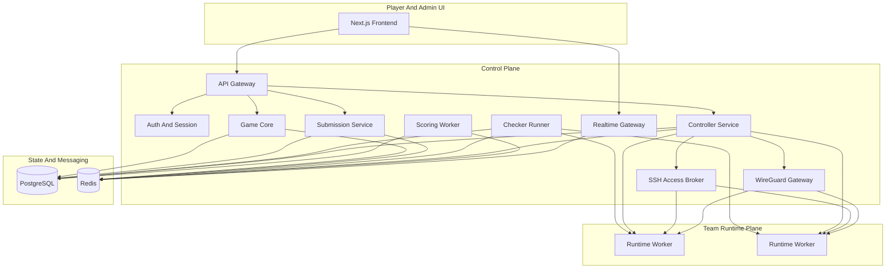
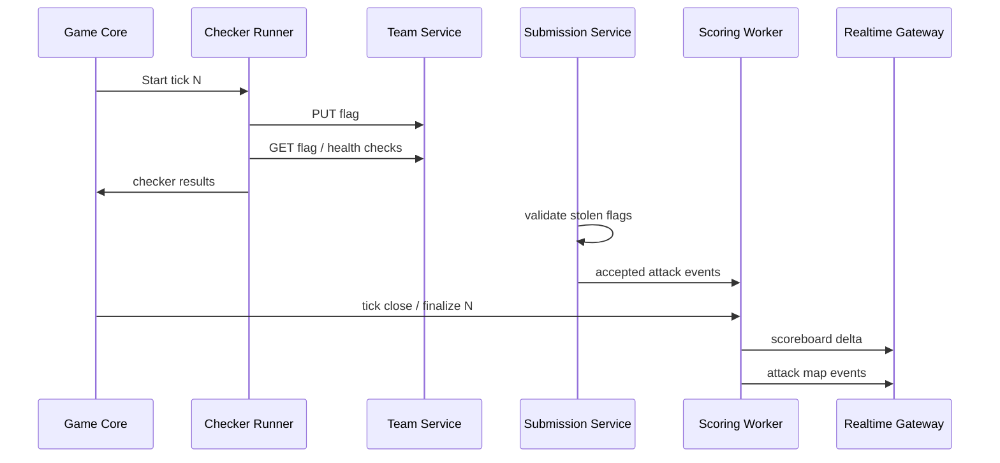

# System Architecture

## 1. Scope

The platform is an Attack-Defense Tick CTF system where each team owns its own running copy of every vulnerable service. Teams attack other teams' services, defend and patch their own services, and earn points from three sources:

- `attack`: valid stolen-flag submissions
- `defense`: keeping own flags from being stolen
- `sla`: checker-confirmed availability and integrity

The platform must also provide:

- a real-time scoreboard
- a live attack map
- Docker-based team service isolation
- isolation between one service and another service
- a controlled workflow to unlock patch access by solving the team's own service
- per-member WireGuard access to the game network
- service reset support
- checker, controller, and submission subsystems

## 2. Architecture Principles

1. Postgres is the source of truth for game state and scoring.
2. Redis is for coordination, queues, locks, caches, and live event fanout.
3. The control plane is isolated from the team service runtime plane.
4. Reset operations must have explicit semantics, especially when teams patch the live service container directly.
5. Patch access is exploit-gated and scoped to the exact `team x service` container.
6. SSH access must stay tightly scoped; the current model uses the same service IP, derives a stable per-team/per-service root password, reapplies it on demand, and restricts port 22 to the owning team after unlock, while a separate maintenance path remains a future hardening option.
7. Every team member gets an individual WireGuard identity so access can be revoked and audited without affecting the whole team.
8. Services are isolated from each other; compromise of one service must not grant lateral movement into sibling services.
9. All score-affecting events and privileged operations are auditable and replayable.

## Technology Baseline

- backend services: Go
- frontend: Next.js
- relational storage: PostgreSQL
- cache, queues, and live event fanout: Redis
- runtime isolation: Docker
- player network access: WireGuard

This uses the requested stack while keeping the control plane simple to operate and the scoring path deterministic.

## Service Decomposition & Rationale

The platform is decomposed into several specialized microservices to ensure security isolation, operational reliability, and horizontal scalability during high-pressure competitions.

### 1. API Gateway (`api-gateway`)
- **Role**: Primary entry point for all participant and administrative requests.
- **Rationale**: Acts as a **security buffer**. Participants never interact directly with game logic or infrastructure controllers. It handles authentication, rate limiting, and input validation, protecting internal services from malicious or malformed traffic.

### 2. Controller Service (`controller-service`)
- **Role**: Manages container lifecycles (Docker) and network access rules.
- **Rationale**: **Privilege Isolation**. Only this service requires root-level access to the host's Docker socket. By isolating this capability, a compromise in the public-facing API or web dashboard does not grant an attacker direct control over the competition infrastructure.

### 3. Game Core (`game-core`)
- **Role**: Authoritative owner of ticks, flag generation, and scoreboard calculations.
- **Rationale**: **Integrity & Performance**. Separating scoring from the API ensures that intensive calculations for hundreds of teams do not impact the responsiveness of the participant interface. It guarantees that game-day "lag" in the UI never affects the deterministic accuracy of the game timing.

### 4. Realtime Gateway (`realtime-gateway`)
- **Role**: Streams live feeds (attacks, scores) via Server-Sent Events (SSE).
- **Rationale**: **Connection Efficiency**. Persistent connections consume significant memory and file descriptors. Offloading this to a specialized service prevents the main API from exhausting resources under high dashboard concurrency.

### 5. Submission Service (`submission-service`)
- **Role**: High-throughput flag ingestion and validation.
- **Rationale**: **Scalability**. During the final minutes of a match, submission volume spikes significantly. This service can be scaled independently to handle "flag storms" without duplicating the entire platform logic.

## Requirement Coverage

| Requirement | Architectural response |
| --- | --- |
| Attack-Defense Tick gameplay | `Game Core` owns ticks, validity windows, and round finalization |
| Attack / defense / SLA points | `Scoring Worker` computes all three from submissions and checker results |
| Scoreboard | `Scoring Worker` writes snapshots, `Realtime Gateway` streams deltas, `Next.js` renders the UI |
| Live attack map | `Submission Service` emits accepted attack events, `Realtime Gateway` pushes them to the UI |
| Docker service per team | `Controller Service` provisions one isolated runtime per `team x service` |
| Teams solve own service to unlock patching | `Direct Container Access Model` validates unlock proof before issuing SSH credentials to the exact service container |
| Reset container service | `Controller Service` supports team-triggered factory reset for each service and optional soft restart |
| Service isolated from other services | Runtime workers place each `team x service` in its own network island with no east-west access to sibling services |
| Team connectivity into the game network | `WireGuard Gateway` issues one peer config per team member and optional automation peers |
| Checker subsystem | `Checker Runner` executes `put/get/check` every tick |
| Controller subsystem | `Controller Service` manages workers, service instances, access grants, and resets |
| Submission subsystem | `Submission Service` validates flags, rejects duplicates, and records accepted steals |

## 3. High-Level Topology



## 4. Major Subsystems

### 4.1 Next.js Frontend

Responsibilities:

- player login and team dashboard
- scoreboard view
- live attack map
- service status per team
- patch access and reset controls
- admin operations

Notes:

- Use server-rendered pages for initial scoreboard and match metadata.
- Use SSE or WebSocket streams for live scoreboard and attack-map updates.
- Keep real-time rendering separate from authoritative scoring logic.

### 4.2 API Gateway

Responsibilities:

- single entry point for frontend clients
- auth/session validation
- request routing to internal services
- rate limiting for user-facing actions
- audit logging for admin and team actions

Suggested API domains:

- `/api/auth`
- `/api/game`
- `/api/team`
- `/api/services`
- `/api/submissions`
- `/api/admin`
- `/api/realtime/token`

### 4.3 Game Core

Responsibilities:

- tick scheduling
- match lifecycle management
- service catalog and weights
- flag validity windows
- round finalization
- publication of tick events

Key rule:

Game Core owns the canonical tick number and the schedule that every other subsystem follows.

### 4.4 Submission Service

Responsibilities:

- receive stolen flags
- decode and validate flag ownership and validity window
- reject duplicates and expired flags
- record accepted submissions
- emit attack events for scoring and live UI

Key properties:

- idempotent validation path
- strict duplicate prevention
- fast path backed by Redis, confirmed in Postgres

### 4.5 Checker Runner

Responsibilities:

- execute service checkers per tick
- run `put`, `get`, and optional `check` phases
- report SLA outcomes
- report failed puts/gets for audit and scoring
- support retries under policy without hiding instability

Design choice:

Checker execution should be queue-driven and horizontally scalable. The scheduler places jobs onto Redis-backed queues; workers execute them and persist results to Postgres.

### 4.6 Controller Service

Responsibilities:

- provision team service containers
- manage runtime workers
- create or restore service instances
- manage service lifecycle actions
- handle team resets
- create SSH access grants after unlock

This service is the control bridge between the game state and Docker.

### 4.7 Scoring Worker

Responsibilities:

- compute attack, defense, and SLA scores per tick
- finalize scoreboard snapshots
- recalculate history if an admin correction is needed
- publish scoreboard deltas to Redis for realtime delivery

Scoring should run as a deterministic, replayable pipeline over stored events.

### 4.8 Realtime Gateway

Responsibilities:

- push scoreboard deltas
- push attack events to the live map
- push service-health changes

Redis pub/sub or streams are appropriate here, but replayable streams are preferable if clients must reconnect and catch up.

### 4.9 SSH Access Broker

Responsibilities:

- issue the current stable per-team/per-service SSH credential after unlock, or move later to ephemeral SSH certificates or keys
- map each credential to exactly one `team x service` container
- enforce owner-only SSH access to the same service IP after unlock
- record session open and close events for audit

This component can be implemented as a small bastion or certificate authority backed by Controller state.

### 4.10 WireGuard Gateway

Responsibilities:

- issue one WireGuard peer configuration per team member
- optionally issue a dedicated automation peer for the team
- route participant traffic into the game network
- support peer revocation without affecting the rest of the team
- audit peer usage and connection metadata

This is the participant access plane for attacking, checking own services, and using SSH to the same service IP after unlock.

## 5. Runtime Plane Design

## 5.1 Container Model

For each `team x service`, run one isolated service instance:

- base service image: vulnerable service maintained by organizers
- runtime container: active copy reachable from the game network
- writable service state: in-container changes made by the team after SSH unlock
- reset target: pristine organizer baseline for that service
- no shared volume or shared network namespace with sibling services

Recommended rule:

Direct SSH access to the exact service container is acceptable here because it matches the competition workflow you want. The important restriction is that SSH must not be part of the public attack surface.

Required controls:

- SSH is disabled until unlock
- credentials are bound to one team and one service
- access is available only to the owning team over WireGuard; future hardening may split a dedicated maintenance subnet
- reset behavior is explicit and visible to teams
- the service is isolated from all other services, including the same team's other services

## 5.2 Runtime Workers

Each runtime worker hosts multiple team containers and should provide:

- Docker Engine or compatible runtime
- per-container resource quotas
- service health probes
- isolated virtual networks
- controller agent connectivity on a private management network

Placement model:

- control plane decides placement
- worker labels can group services by resource class
- avoid co-locating all copies of a critical service on one worker

## 5.3 Network Segmentation

Recommended networks:

1. `public-ui-network`
   - frontend and public API ingress
2. `player-vpn-network`
   - WireGuard peers enter the game environment here
3. `game-edge-network`
   - ingress path from the VPN plane to published team service ports
4. `checker-network`
   - checker workers reaching service endpoints
5. `management-network`
   - controller to runtime workers, SSH broker, and WireGuard gateway
6. optional `maintenance-network`
   - future hardening path if you later split SSH away from the shared service IP
7. `storage-network`
   - internal access to Postgres and Redis

Rules:

- only intended service ports are exposed on the game edge
- no direct access from players to Postgres or Redis
- SSH uses the same service IP in the current model and is reachable on port 22 only for the owning team after unlock
- container egress should be limited to what the game requires
- each service is published through a dedicated network policy or proxy rule, not by sharing a flat east-west container network

## 5.4 Service Isolation

Service isolation should be stricter than "one container per service".

Required properties:

- one `team x service` cannot directly open connections to sibling services
- no shared Docker networks between unrelated services
- no shared writable volumes between services
- health checks, checker traffic, and player traffic reach a service only through its published endpoint
- compromise of `service A` must not provide routable access to `service B`

Practical implementation choices:

- dedicated bridge network per `team x service`
- a service ingress proxy that forwards only the intended port
- container firewall rules that default-deny east-west traffic
- separate UNIX users, volumes, and secrets per service

## 5.5 Participant Access Model

Each team member should receive an individual WireGuard configuration.

Benefits:

- one teammate can be revoked without rotating the whole team
- access logs can be tied to a member identity
- teams can use their own machines while keeping the service network private

Recommended addition:

- issue one optional `team-bot` WireGuard peer for automation running on a VPS or server

This avoids forcing teams to reuse a human member credential for headless automation.

## 6. Direct Container Access Model

## 6.1 Unlock Requirement

The requirement says teams must solve their own service to unlock patch access. The cleanest model is:

1. every `team x service` image contains a team-specific unlock secret or challenge path
2. the team obtains that secret by exploiting or solving its own service
3. the team submits the unlock proof to the platform
4. the platform exposes the stable team SSH credential for the matching service container
5. a later factory reset preserves unlock status for that team/service during the same match

Implementation options:

- hidden file or token only reachable through exploitation
- special challenge endpoint guarded by the intended vulnerability
- secret derived from `HMAC(master_secret, team_id, service_id, season_salt)`

## 6.2 Direct Service Container Access

Once unlocked, the team receives:

- the stable per-team/per-service root password or a future equivalent ephemeral SSH credential
- access only to that `team x service` container
- owner-only SSH rules on the same service IP, with an optional future maintenance subnet or bastion route
- a reset control for that exact service
- a per-service persistent state volume so organizer baseline and team-mutated state can be reset deterministically

Implementation options:

- run `sshd` inside the service container and enable it only after unlock
- use a sidecar or namespace-sharing helper that provides SSH into the exact service namespace
- broker `docker exec` behind an SSH bastion while preserving the illusion of direct container access

Recommended controls:

- stable credential material today, with an optional future move to expiring credentials
- per-session audit logs
- access limited to the owning team only
- optional IP or VPN binding to the requesting WireGuard peer

## 6.3 Why This Model Fits Attack-Defense Better

For many Attack-Defense competitions, direct access to the owned service container is the expected team workflow:

- the team exploits its own service
- the team enters the exact service instance
- the team patches live files or configuration
- if the patch breaks SLA, the team factory-resets that service and tries again

That is a valid and competition-faithful model. It is less operationally clean than a patchbox, but it matches your stated target better.

## 7. Reset Model

Reset behavior must be explicit, because direct container patching means teams may intentionally want to discard broken changes.

Recommended reset types:

### 7.1 Team Reset

Purpose:

- restart a broken service instance for the team
- recover from crashes, deadlocks, or a bad patch

Behavior:

- destroy the current running container
- remove the attached per-service state volume
- recreate it from the organizer baseline image for that team/service
- discard in-container patch changes
- preserve audit history
- preserve unlock state for that team/service during the same match

This is the normal player-facing reset.

Recommended default:

- keep the service unlocked for that team after reset during the same match

### 7.2 Optional Soft Restart

Purpose:

- recover a service process without discarding the current patched filesystem state

Behavior:

- restart the current container or service process
- preserve the attached per-service state volume
- preserve current filesystem modifications

This is optional, but useful if you want both a `restart` button and a `factory reset` button.

### 7.3 Admin Overrides

Purpose:

- perform mass reset, forced unlock revoke, or emergency restore during maintenance

Behavior:

- force restart or factory reset one or more services
- revoke or extend active SSH access grants
- preserve auditability for dispute resolution

## 8. Data Ownership

## 8.1 PostgreSQL

Authoritative tables should include:

- `teams`
- `users`
- `services`
- `team_services`
- `matches`
- `ticks`
- `flags`
- `submissions`
- `checker_runs`
- `sla_results`
- `score_entries`
- `score_snapshots`
- `attack_events`
- `reset_events`
- `patch_unlocks`
- `ssh_access_grants`
- `container_sessions`
- `wireguard_peers`
- `wireguard_peer_members`
- `audit_logs`

Use Postgres for:

- permanent game state
- scoring history
- audit trails
- admin actions
- replay and dispute resolution

## 8.2 Redis

Use Redis for:

- distributed locks
- tick fanout events
- submission dedup hot path
- checker job queues
- websocket/SSE fanout
- SSH credential material and rate-limit counters

Do not rely on Redis as the sole record for score-affecting events.

## 9. Flag Model

Recommended flag structure:

- encode `match_id`, `team_id`, `service_id`, `tick_id`, `slot`
- add a MAC or signature using a server-side secret
- include a short version prefix for future compatibility

This allows:

- fast validation in Submission Service
- deterministic regeneration
- easier incident recovery

Persist at least:

- issue status
- owning team/service/tick
- first valid submitter
- first submission time

## 10. Tick Lifecycle



Detailed tick flow:

1. Game Core opens tick `N`.
2. Checker Runner executes `put` for each `team x service`.
3. Checker Runner executes `get` and service health checks.
4. Teams attack opponents and submit stolen flags.
5. Submission Service validates and records accepted flags in real time.
6. At the scoring boundary, Scoring Worker finalizes tick `N`.
7. Scoreboard snapshots and attack-map events are pushed to clients.

## 11. Scoring Model

The platform should support a configurable scoring engine, but a practical default is:

- `attack_score(team, tick)` = weighted count of first-valid enemy flags submitted by that team
- `defense_score(team, service, tick)` = proportion of issued flags for that team/service/tick not stolen before expiry
- `sla_score(team, service, tick)` = weighted result from checker `put/get/check` outcomes

Suggested properties:

- unique flag may score only once globally
- the first valid submitter gets the attack points
- defense is computed after the flag submission window closes
- SLA is based only on checker outcomes, not on attack traffic
- per-service weights are configurable

See [Game Rules And Runtime Flows](game-rules.md) for a concrete default formula.

## 12. Live Scoreboard And Attack Map

The scoreboard should be built from finalized score entries, not ad hoc in-memory counters.

Recommended live pipeline:

1. Scoring Worker writes finalized score entries to Postgres.
2. It publishes a compact delta event to Redis streams.
3. Realtime Gateway consumes the stream and pushes updates to clients.
4. Frontend updates rank tables, charts, and the live attack map.

Attack map event payload should contain:

- attacker team
- victim team
- service
- tick
- timestamp
- optional location metadata for rendering

## 13. Failure Handling

### 13.1 Controller Failure

- desired state remains in Postgres
- workers reconcile after restart
- pending operations are re-queued from Redis or rebuilt from the database

### 13.2 Checker Failure

- each checker run is recorded with attempt and timeout data
- retries must be bounded and visible
- stale or missing runs should degrade SLA predictably, not silently disappear

### 13.3 Realtime Failure

- UI degrades to polling scoreboard snapshots
- scoring remains correct because truth is in Postgres

## 14. Security And Fairness Controls

- strong service-to-service authentication inside the control plane
- signed unlock tokens and tightly scoped SSH credentials
- auditable admin actions with persistent audit log
- team-less organizer accounts to isolate administrative access from game infrastructure
- immutable score event history
- submission rate limits
- per-team access controls for SSH and reset actions
- per-member peer revocation for WireGuard access
- container resource limits to reduce noisy-neighbor issues
- predictable tick boundaries based on server time only
- authoritative infrastructure cleanup: deleting a team or challenge automatically removes associated containers and volumes via the controller service

## 15. Deployment Models

The platform supports two primary deployment models:

1. **Standard Docker Compose**: All services run in isolated containers. Suitable for development and small-scale private testing.
2. **Host Enforcement (`prod-host`)**: Specialized for production environments where real network isolation and firewall rules are required. In this mode, the **Controller** and **WireGuard Gateway** interact directly with the host's networking stack.

For detailed instructions on setting up the production model, see [Deployment: Host (Debian/Ubuntu/Arch)](deployment-host.md).

## 16. Recommended Monorepo Layout

```text
.
├── apps
│   └── web                      # Next.js frontend
├── services
│   ├── api-gateway
│   ├── game-core
│   ├── submission-service
│   ├── checker-runner
│   ├── controller-service
│   ├── scoring-worker
│   ├── realtime-gateway
│   └── wireguard-gateway
├── packages
│   ├── go
│   │   ├── auth
│   │   ├── events
│   │   ├── flags
│   │   ├── scoring
│   │   └── storage
│   └── typescript
│       └── ui-sdk
├── deploy
│   ├── docker
│   ├── compose
│   └── k8s
├── docs
└── tools
```

## 16. Build Order

1. Game Core with match, tick, and service catalog management
2. Submission Service with deterministic flag validation
3. Controller Service with team-service provisioning and team factory reset
4. WireGuard Gateway with member and bot peer provisioning
5. Checker Runner with `put/get/check`
6. Scoring Worker and finalized score snapshots
7. Realtime Gateway plus frontend scoreboard
8. Patch unlock and direct SSH access flow
9. Admin tooling, audit, and recovery workflows

## 17. Decision Summary

This architecture satisfies the requested Attack-Defense Tick requirements by:

- using Docker-isolated team service instances
- separating checker, controller, and submission services
- supporting attack, defense, and SLA scoring
- exposing a live scoreboard and attack map
- providing team-triggered factory reset for SLA recovery when a patch goes wrong
- requiring teams to solve their own service before SSH access to that service container is granted
- preserving unlock state after factory reset so teams can recover quickly without re-solving
- giving each team member an individual WireGuard identity for secure access into the game network
- isolating each service from sibling services to reduce lateral movement and preserve fairness
- supporting dynamic management of teams, players, and challenges with automated infrastructure cleanup
- keeping the game state replayable, auditable, and operationally manageable
